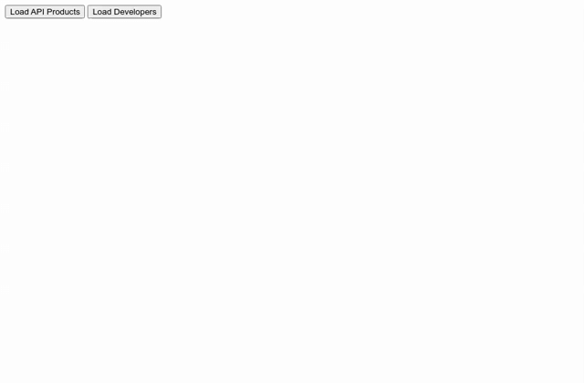

# apigee-x-portal-tester

Developer portals are awesome projects that help developers get started using your APIs, but they can start small in DIY web apps.  This project shows the first steps for consuming the Apigee X API to load API products to integrate in your own homemade developer portal using Apigee.

## Deploy
To deploy simply set your [Google Default Application Credentials](https://cloud.google.com/docs/authentication/production) either through an environment variable or a cloud deployment, and run the nodejs service:

```ssh
npm start
```

Or you can deploy the app with one click to Cloud Run:

[](https://deploy.cloud.run)


Then you can open your browser to http://localhost:8080 and use the sample tester app.

